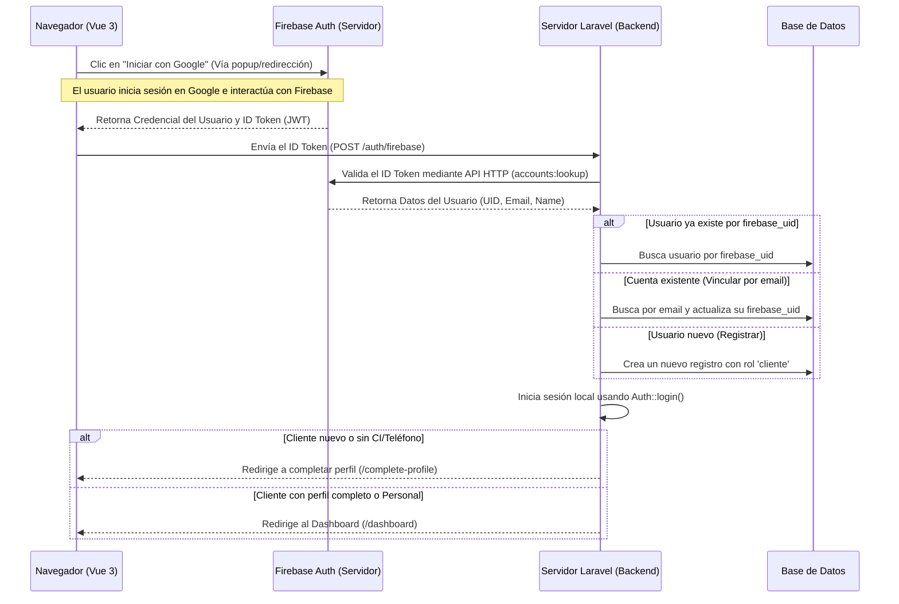

# Flujo de Autenticación con Firebase Auth

**Ruta del archivo:** `docs/firebase_auth/01_intro_flow.md`

Este documento explica el funcionamiento técnico de la autenticación de usuarios en el proyecto **Licorvintage** utilizando **Firebase Auth** para el inicio de sesión y registro de clientes.

---

## 1. Diagrama de Secuencia del Flujo

A continuación se detalla cómo interactúan el Navegador (Frontend Vue 3), los Servidores de Firebase y nuestra aplicación (Backend Laravel):



---

## 2. Detalles del Flujo Técnico

### A. Autenticación en el Frontend (Firebase SDK)
Cuando el usuario hace clic en el botón de **Iniciar con Google**, se invoca el SDK de Firebase en el cliente:
1. Se obtiene el objeto de autenticación configurado (`getFirebaseAuth()`).
2. Se inicia la ventana emergente (`signInWithPopup`) usando `GoogleAuthProvider`.
3. Firebase valida las credenciales y devuelve un objeto de usuario del cual se extrae el **ID Token**:
   ```javascript
   const idToken = await result.user.getIdToken();
   ```

### B. Validación en el Backend (Laravel)
El frontend envía por POST el `idToken` a la ruta `/auth/firebase`.
Laravel no decodifica el JWT de forma manual ni local para evitar complejidades y dependencias pesadas; en su lugar, realiza una petición segura (de servidor a servidor) usando la API oficial de Firebase:

* **Endpoint:** `POST https://identitytoolkit.googleapis.com/v1/accounts:lookup?key={FIREBASE_API_KEY}`
* **Cuerpo:** `{"idToken": "TOKEN_ENVIADO"}`

Si el token es válido y vigente, Firebase devuelve la información de la cuenta en formato JSON:
```json
{
  "users": [
    {
      "localId": "FIREBASE_UID_UNICO",
      "email": "correo@gmail.com",
      "displayName": "Nombre Completo"
    }
  ]
}
```

### C. Registro y Vinculación
Una vez validados los datos, se procesa la sesión:
1. **Buscar por UID**: Se busca al usuario por `firebase_uid` en la base de datos de Laravel. Si se encuentra, se inicia sesión.
2. **Vinculación por Email**: Si no se encuentra por `firebase_uid` pero el correo ya está registrado en el sistema, se actualiza el registro guardando su `firebase_uid` y se inicia sesión.
3. **Registro**: Si no existe de ninguna forma, se crea un nuevo usuario cliente con una contraseña aleatoria y segura y se le asigna el rol `cliente`.

### D. Onboarding del Cliente
Si el usuario autenticado tiene el rol `cliente` y sus campos obligatorios `ci` (Carnet de Identidad) o `phone` (Teléfono) están vacíos, se le redirige inmediatamente al formulario de `/complete-profile` para completar sus datos.
