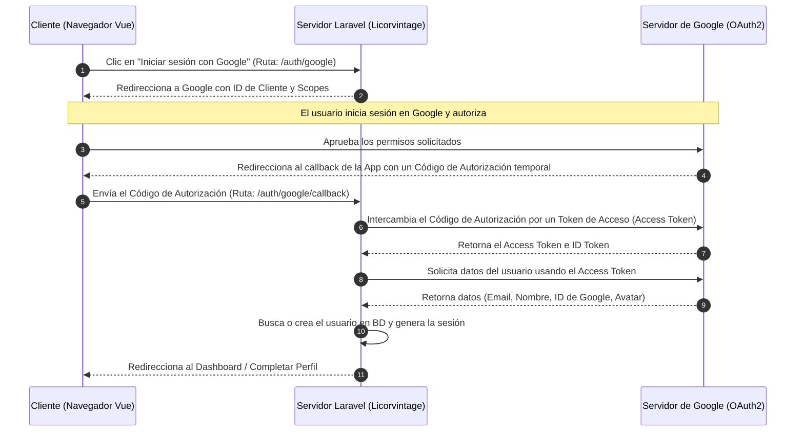

# Flujo de Autenticación y Manejo de Tokens (Google SSO)

**Ruta del archivo:** `docs/google_sso/01_intro_flow.md`

Este documento explica cómo funciona técnicamente la integración de inicio de sesión con Google (Single Sign-On - SSO) en el proyecto **Licorvintage** utilizando el protocolo OAuth 2.0.

---

## 1. El Flujo de Autenticación OAuth 2.0

OAuth 2.0 es el estándar de la industria para autorización. En lugar de compartir las credenciales (correo y contraseña de Google) con nuestra aplicación, el usuario autoriza a Google para que nos entregue de forma segura ciertos datos de su perfil.

El proceso sigue estos pasos:

---

## 2. Explicación del Intercambio de Tokens

Cuando el usuario aprueba los permisos, el flujo pasa por dos tipos de tokens principales detrás de escena:

### A. El Código de Autorización (Authorization Code)
Es un código de corta vida útil que Google envía de vuelta al navegador. Este código no tiene información del usuario por sí mismo, sino que sirve como un "recibo" temporal que demuestra que el usuario autorizó a la aplicación.

### B. El Token de Acceso (Access Token)
Nuestra aplicación (Laravel) toma el *Código de Autorización* y, de forma segura desde el backend (servidor a servidor), se lo envía a Google junto con el **Client Secret** (el secreto de nuestra aplicación). Google valida que las credenciales del servidor sean correctas y nos responde con un **Access Token** (Token de Acceso).

### C. Obtención de los Datos del Usuario
Con el **Access Token**, Laravel realiza una solicitud HTTP interna a la API de Google (`https://www.googleapis.com/oauth2/v3/userinfo`) para descargar el perfil público del usuario. Los datos que obtenemos son:
*   `id` (ID único de Google del usuario)
*   `name` (Nombre completo registrado en su cuenta de Google)
*   `email` (Dirección de correo electrónico de Gmail)
*   `avatar` (Enlace a la foto de perfil del usuario)

---

## 3. Lógica del Callback en Licorvintage

Una vez que Laravel recibe los datos del usuario de Google, se ejecuta la siguiente lógica en `App\Http\Controllers\Auth\GoogleController`:

1. **Búsqueda por `google_id`**: Buscamos en la base de datos si ya existe un usuario que tenga registrado ese `google_id`. Si existe, iniciamos su sesión local usando `Auth::login($user)`.
2. **Vinculación por `email`**: Si no se encuentra el `google_id` pero el correo (`email`) ya existe en la base de datos (por ejemplo, porque el usuario se registró previamente de forma manual), vinculamos la cuenta actualizando su `google_id` y luego iniciamos sesión.
3. **Registro Automático (Nuevo Cliente)**: Si el correo no existe, registramos un nuevo usuario:
   *   `name` = Nombre entregado por Google.
   *   `email` = Correo de Google.
   *   `google_id` = ID de Google.
   *   `password` = Se le genera una contraseña segura aleatoria y encriptada (para cumplir con la base de datos sin comprometer la seguridad).
   *   Se le asigna automáticamente el rol **`cliente`**.
   *   Se inicia su sesión.
4. **Verificación de Perfil Completo (Onboarding)**:
   *   Si el usuario autenticado tiene el rol `cliente` y sus campos `ci` (Carnet de Identidad) o `phone` (Teléfono) están vacíos (lo cual ocurre al registrarse por primera vez con Google), el sistema lo redirigirá inmediatamente a `/complete-profile` mediante un middleware de control.
