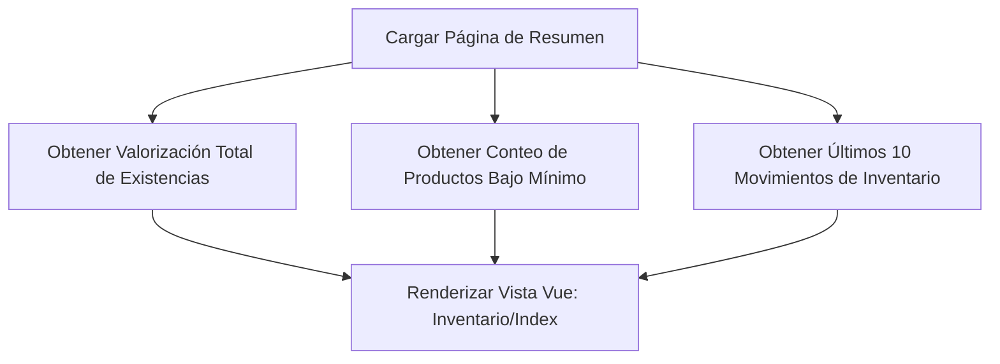

# Pestaña 1: Resumen (Dashboard de Inventario)

**Ruta del archivo:** `docs/inventario/01_resumen.md`

Esta pestaña proporciona una vista general ejecutiva del estado físico y financiero del almacén de **Licorvintage**.

---

## 1. Diagrama de Flujo de Datos

---

## 2. Lógica Técnica y Datos Asociados

### A. Valorización Total
*   **Qué hace**: Calcula el valor monetario de toda la mercadería disponible en almacén en tiempo real.
*   **Fórmula**: Sumatoria del (Stock Actual $\times$ Costo Promedio Ponderado) de todos los productos del catálogo.
*   **Código Backend**: `InventarioService::valorizacionTotal()`

### B. Productos Bajo Mínimo
*   **Qué hace**: Cuenta cuántos productos tienen un stock actual menor a la propiedad `min` (stock mínimo de seguridad) configurada en su registro.
*   **Código Backend**: `InventarioService::productosBajoMinimo()`

### C. Últimos Movimientos
*   **Qué hace**: Lista los últimos 10 movimientos registrados en la tabla `movimiento_inventarios` ordenados del más reciente al más antiguo.
*   **Relaciones**: Incluye el nombre del producto y el nombre del usuario responsable.

---

## 3. ¿Cómo hacer que refleje datos reales?

Para ver esta pantalla con información real, realiza lo siguiente en el sistema:
1.  **Crear un producto con stock mínimo**: Ve al módulo de **Productos**, registra uno nuevo y configúrale:
    *   `min` (Stock mínimo) = `10`
    *   `stock` inicial = `5`
    *   *Efecto*: En el Resumen, el indicador de **Productos bajo mínimo** aumentará inmediatamente a **`1`**.
2.  **Registrar movimientos**: Registra una compra en **Compras** o realiza una venta en **Caja**.
    *   *Efecto*: El indicador de **Valor Total** aumentará o disminuirá, y el movimiento aparecerá al instante en la lista de **Últimos Movimientos** mostrando qué compraste o vendiste.
