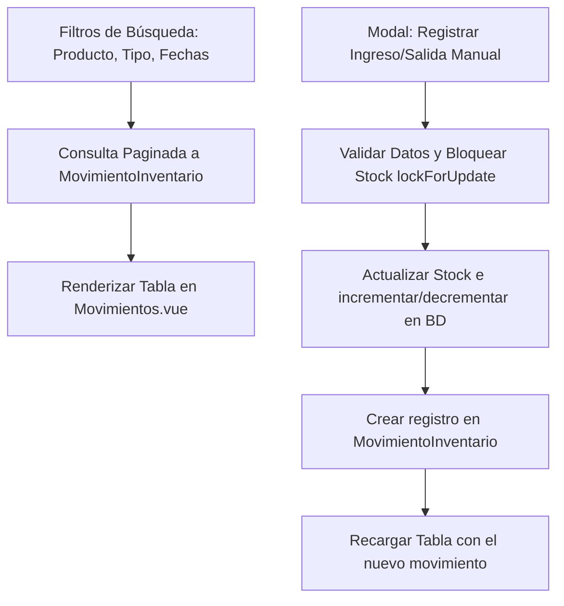

# Pestaña 2: Movimientos (Bitácora de Entradas y Salidas)

**Ruta del archivo:** `docs/inventario/02_movimientos.md`

Esta pestaña sirve como una bitácora o libro de contabilidad de almacén de **Licorvintage**, registrando de forma cronológica cada entrada y salida de mercadería.

---

## 1. Diagrama de Flujo de Datos

---

## 2. Lógica Técnica y Datos Asociados

### A. Listado de Movimientos (Paginación y Filtros)
*   **Qué hace**: Recupera y pagina (de 15 en 15) el historial de transacciones de inventario.
*   **Filtros**: Permite buscar movimientos específicos por un producto, un tipo de movimiento o rangos de fecha.
*   **Código Backend**: `InventarioController::movimientos()`

### B. Registro de Ingresos Manuales (Devoluciones, Stock Inicial)
*   **Campos de Entrada (Request)**: `producto_id`, `cantidad`, `costo_unitario`, `motivo`.
*   **Procesamiento**: Se incrementa el stock en la tabla `stocks`, se recalcula el Costo Promedio Ponderado del producto en la tabla `productos` y se crea la fila correspondiente en `movimiento_inventarios` con el tipo `ingreso_devolucion`.

### C. Registro de Salidas Manuales (Mermas, Daños)
*   **Campos de Entrada (Request)**: `producto_id`, `cantidad`, `motivo`.
*   **Procesamiento**: Valida que haya stock suficiente. Si lo hay, reduce el stock físico de la tabla `stocks` y crea la fila en `movimiento_inventarios` de tipo `salida_merma` valorizada al costo promedio actual.

---

## 3. ¿Cómo hacer que refleje datos reales?

Para alimentar y ver transacciones en esta vista:
1.  **Ingreso por Compras**: Registra una compra en el módulo de **Compras**.
    *   *Efecto*: Aparecerá automáticamente una fila de tipo `ingreso_compra` en esta tabla.
2.  **Salida por Ventas**: Realiza una venta en el módulo de **Ventas/Caja**.
    *   *Efecto*: Aparecerá automáticamente una fila de tipo `salida_venta` en esta tabla.
3.  **Registros manuales desde la misma pestaña**:
    *   Haz clic en **Registrar Ingreso** o **Registrar Salida** en la esquina superior de la pestaña.
    *   Ingresa los datos del producto (ej. 2 botellas mermadas por rotura).
    *   *Efecto*: La tabla se actualizará inmediatamente con el nuevo registro de tipo `salida_merma` o `ingreso_devolucion`.
