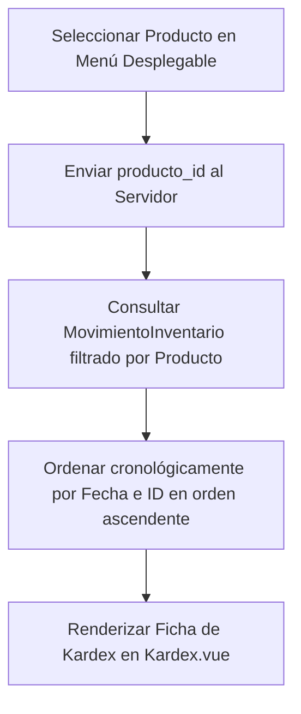

# Pestaña 3: Kardex (Control de Saldos y Costos Ponderados)

**Ruta del archivo:** `docs/inventario/03_kardex.md`

Esta pestaña representa el control oficial contable e individualizado de existencias para un producto específico en **Licorvintage**.

---

## 1. Diagrama de Flujo de Datos

---

## 2. Lógica Técnica y Datos Asociados

### A. Consulta Individual y Ordenamiento
*   **Qué hace**: Recupera el histórico completo de un artículo seleccionado.
*   **Ordenamiento**: A diferencia de la bitácora general de movimientos (que muestra lo más nuevo primero), el Kardex se ordena de forma **ascendente** (`orderBy('created_at')->orderBy('id')`) para que el cálculo acumulativo del saldo de stock sea correcto en el tiempo.
*   **Código Backend**: `InventarioController::kardex()`

### B. Estructura de Columnas de Saldos Acumulados
Cada fila del Kardex muestra:
1.  **Detalles del movimiento**: Fecha, tipo de operación (Compra, Venta, Ajuste) y el motivo.
2.  **Entradas / Salidas**: Cantidad de unidades transadas y su costo unitario.
3.  **Saldos Históricos**: 
    *   `saldo_cantidad`: Cuántas botellas quedaban en almacén exactamente en ese momento histórico.
    *   `saldo_costo_promedio`: El costo promedio ponderado exacto en ese momento histórico.

---

## 3. ¿Cómo hacer que refleje datos reales?

Para ver una hoja de Kardex completa y entender cómo evoluciona:
1.  Ingresa a la pestaña **Kardex** y selecciona un producto del buscador (por ejemplo: `Fernet Branca`).
2.  Si el producto no tiene transacciones registradas, la tabla estará vacía. Para poblarla, realiza la siguiente secuencia de operaciones reales con ese producto:
    *   **Paso 1 (Compra Inicial)**: Registra una compra de `10` unidades a `$80.00`.
        *   *Kardex*: Mostrará una entrada de `10` y un saldo de `10` a un costo promedio de `$80.00`.
    *   **Paso 2 (Venta)**: Vende `2` unidades en caja.
        *   *Kardex*: Mostrará una salida de `2` y un saldo actualizado de `8` a un costo promedio de `$80.00`.
    *   **Paso 3 (Compra con nuevo costo)**: Registra una compra de `10` unidades a `$90.00`.
        *   *Kardex*: Mostrará una entrada de `10`, un saldo de `18` y un costo promedio acumulado recalculado automáticamente a `$85.56`.
