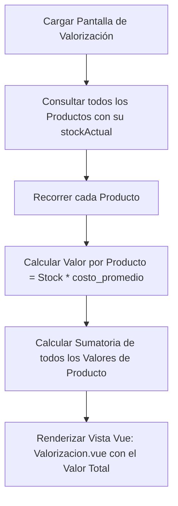

# Pestaña 4: Valorización (Costo Promedio Ponderado - CPP)

**Ruta del archivo:** `docs/inventario/04_valorizacion.md`

Esta pestaña valoriza económicamente el stock físico del almacén para conocer el valor exacto del activo circulante en licores de **Licorvintage**.

---

## 1. Diagrama de Flujo de Datos

---

## 2. Lógica Técnica y Datos Asociados

### A. Algoritmo de Costo Promedio Ponderado (CPP)
El costo promedio ponderado de un producto se actualiza automáticamente cada vez que se registra un **ingreso** (compra o ajuste positivo) en el almacén mediante la fórmula:

$$\text{Nuevo Costo Promedio} = \frac{(\text{Stock Actual} \times \text{Costo Promedio Ponderado Actual}) + (\text{Cantidad Ingresada} \times \text{Costo Unitario de Ingreso})}{\text{Stock Actual} + \text{Cantidad Ingresada}}$$

*   Las **salidas** (ventas o pérdidas) no alteran el costo promedio ponderado del producto, solo reducen su stock físico, por lo que se valorizan al último costo promedio calculado.
*   **Código Backend**: `InventarioService::recalcularCostoPromedio()`

### B. Valorización por Producto
*   **Qué hace**: Multiplica el stock disponible en la tabla `stocks` por su `costo_promedio` de la tabla `productos` para obtener el costo del lote actual.
*   **Código Backend**: `InventarioController::valorizacion()`

---

## 3. ¿Cómo hacer que refleje datos reales?

Para alimentar y visualizar datos en esta pestaña:
1.  **Registrar un producto con costo**: Crea un producto en el sistema.
2.  **Registrar compras a diferentes costos**:
    *   Registra una compra de `10` unidades de ese producto a `$100.00`. 
        *   *Efecto*: En la pestaña de Valorización verás que el producto tiene stock `10`, costo promedio `$100.00`, y un valor total de `$1,000.00`.
    *   Registra una segunda compra del mismo producto por `5` unidades a `$120.00`.
        *   *Efecto*: El stock subirá a `15`, el costo promedio ponderado se recalculará a `$106.67`, y la valorización total del producto se actualizará a `$1,600.00` automáticamente.
3.  **Visualizar el Valor Total**: La esquina superior de la pestaña mostrará la sumatoria total del valor económico de todos los productos en tu bodega.
