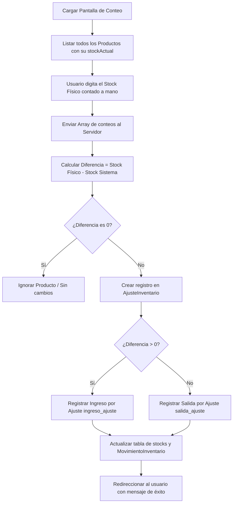

# Pestaña 5: Conteo (Auditoría e Inventario Físico)

**Ruta del archivo:** `docs/inventario/05_conteo.md`

Esta pestaña permite al encargado realizar auditorías de stock en estantería para corregir y conciliar las discrepancias entre el inventario del sistema y la realidad física del almacén de **Licorvintage**.

---

## 1. Diagrama de Flujo de Datos

---

## 2. Lógica Técnica y Datos Asociados

### A. Obtención del Inventario de Auditoría
*   **Qué hace**: Carga todo el catálogo de productos con su stock teórico registrado en la base de datos para que el bodeguero anote el conteo manual.
*   **Código Backend**: `InventarioController::conteo()`

### B. Proceso de Conciliación y Ajuste Automático
Cuando se hace clic en el botón **Guardar Conteo**, la aplicación realiza una transacción en la base de datos ejecutando los siguientes pasos:
1.  **Diferencia de Stock**: Calcula la discrepancia para cada producto:
    $$\text{Diferencia} = \text{Stock Físico Real} - \text{Stock Teórico del Sistema}$$
2.  **Registro de Auditoría**: Si la diferencia no es 0, crea una fila en la tabla `ajuste_inventarios` con el ID del usuario auditor, la diferencia, el stock esperado y el stock físico real.
3.  **Ajuste Físico**:
    *   **Sobrantes (Diferencia > 0)**: Significa que hay más producto en la realidad que en el sistema. El sistema ejecuta `registrarIngreso()` con el tipo `ingreso_ajuste` para sumar esas botellas y cuadrarlas al costo promedio actual.
    *   **Faltantes (Diferencia < 0)**: Significa que se perdieron o rompieron botellas sin registrar. El sistema ejecuta `registrarSalida()` con el tipo `salida_ajuste` para descontar esas botellas físicamente de la base de datos.
*   **Código Backend**: `InventarioService::ajustarPorConteo()`

---

## 3. ¿Cómo hacer que refleje datos reales?

Esta pestaña no requiere que ingreses datos en otra parte del sistema para que funcione; es la que **inicia** el flujo de auditoría. Para probarla:
1.  Ve a la pestaña **Conteo**.
2.  Supongamos que el producto `Fernet Branca` tiene un stock en el sistema de `10` unidades.
3.  Si realizas una inspección visual de las estanterías de la tienda y cuentas únicamente `8` botellas reales (faltan 2):
    *   Escribe `8` en la casilla del producto `Fernet Branca`.
    *   Haz clic en **Guardar Conteo** (o *Completar Registro*).
4.  **Efecto inmediato en el sistema**:
    *   El stock del producto bajará automáticamente de `10` a `8` en la base de datos.
    *   Si vas a la pestaña **Movimientos**, verás un nuevo registro de tipo `salida_ajuste` con cantidad `2` y motivo "Conteo físico".
    *   Si vas a la pestaña **Kardex** de ese producto, verás la fila de salida del ajuste reflejando la auditoría realizada.
